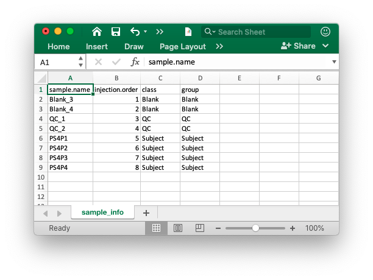

```{r, include = FALSE, echo=FALSE}
knitr::opts_chunk$set(
  collapse = TRUE,
  comment = "#>",
  warning = FALSE,
  message = TRUE,
  out.width = "100%"
)
```

We can use `masscleaner` for missing value (MV) imputation.

First, we need to prepare samples for `masscleaner`.

## **Data preparation**

### **Peak table**

The peak table (csv format) can be from any software. We recommend that you use the `Peak_table_for_cleaning.csv` from `processData()` function from `masscleaner`.

If you use other software, please make sure that the top 3 columns are `name` (peak name), `mz` and `rt` (retention time, second). And the left column are sample intensity.


### **Sample information**

We need the sample information (csv format) to define the detailed information of samples. Column 1 is `sample.name`, column 2 is `injection.order`, column 3 is `class` (such as Subject, QC, Blank), column 4 is `batch` and column 5 is `group` (such as control and case).





## **Read data**

Then place the peak table and sample information in a folder. We use the demo data from `demoData` package.

```{r,eval=FALSE,warning=FALSE, R.options="", message=FALSE, cache=FALSE}
library(masscleaner)
library(demoData)
library(tidyverse)
```

### **Load demo data**

```{r,eval=FALSE,warning=FALSE, R.options="", message=FALSE,cache = TRUE}
##creat a folder nameed as example
path <- file.path(".", "example")
dir.create(path = path, showWarnings = FALSE)
```

```{r,eval=FALSE,warning=FALSE, R.options="", message=FALSE, cache=TRUE}
##get demo data
demo_data <- system.file("masscleaner", package = "demoData")

file.copy(from = file.path(demo_data, dir(demo_data)), 
          to = path, overwrite = TRUE, recursive = TRUE)
```

Here, we have two peak tables, `batch1.data.csv` and `batch2.data.csv`, and `sample_info.csv` are in your `./example` folder.

### **Creat `metflowClass` object**

```{r,eval=FALSE,warning=FALSE, R.options="", message=FALSE, cache=TRUE}
object <-
  create_metflow_object(
    ms1.data = c("batch1.data.csv", "batch2.data.csv"),
    sample.information = "sample_info.csv",
    path = path
  )
```

`object` is a `metflowClass` object, so you can print it in the console.

```{r,eval=FALSE,warning=FALSE, R.options="", message=FALSE, cache=TRUE}
object
```


## **Align different batches**

Because there are two batch peak tables, so first we must align them.

```{r,eval=FALSE,warning=FALSE, R.options="", message=FALSE, cache=TRUE}
object <- align_batch(
  object = object,
  combine.mz.tol = 15,
  combine.rt.tol = 30,
  use.int.tol = FALSE
)
```

```{r,eval=FALSE,warning=FALSE, R.options="", message=FALSE, cache=TRUE}
object
```

## **Missing value processing**

First, we should remove some peaks and samples which have a lot of missing values.

### **Remove noisy peaks and outlier samples**

We use `filter_peaks()` function to filter noisy peaks.

```{r,eval=FALSE,warning=FALSE, R.options="", message=FALSE, cache=TRUE}
object2 <- filter_peaks(
  object = object,
  min.fraction = 0.5,
  type = "any",
  min.subject.blank.ratio = 2,
  according.to = "class",
  which.group = "QC"
)
```

There are three creteria in `filter_peaks()` to remove peaks:

* Missing value

If you want to remove peaks according to peaks NA in samples. You should what groups you want to use. For example, if you want to remove peaks which have more than 50% NA in QC samples, you can set `according.to` as `class`, because `QC` group is defined in `class` column in `sample.info`, then the which.group should be set as `QC`, and `min.fraction` as `0.5`.

```{r,eval=FALSE,warning=FALSE, R.options="", message=FALSE, cache=TRUE}
object2 <- filter_peaks(
  object = object,
  min.fraction = 0.5,
  according.to = "class",
  which.group = "QC"
)
```

If you want to remove peaks which have more than 50% NAs in `QC` and/or `Subject` samples.You can set which.group as `c("QC", "Subject")`, a vector. And the type is `all` means the peaks should meet the `min.fraction` in `QC` **and** `Subject`, and `any` means that the peaks meet the `min.fraction` in `QC` **or** `Subject`.

```{r,eval=FALSE,warning=FALSE, R.options="", message=FALSE, cache=TRUE}
object2 <- filter_peaks(
  object = object,
  min.fraction = 0.5,
  according.to = "class",
  which.group = c("QC", "Subject"),
  type = "all"
)
```

```{r,eval=FALSE,warning=FALSE, R.options="", message=FALSE, cache=TRUE}
object2 <- filter_peaks(
  object = object,
  min.fraction = 0.5,
  according.to = "class",
  which.group = c("QC", "Subject"),
  type = "any"
)
```

* Blank samples

If you have `Blank` samples in your data, you can also remove some peaks according to `Blank` samples. If `min.subject.blank.ratio` is set as 2, it means thay only the peak whoes intensitys in `which.group` samples is higher than 2 times of intensitys in `Blank` samples will be left. If `min.subject.blank.ratio` is set < 1, no peaks will be removed.

```{r,eval=FALSE,warning=FALSE, R.options="", message=FALSE, cache=TRUE}
object2 <- filter_peaks(
  object = object,
  min.fraction = 0.5,
  according.to = "class",
  which.group = c("QC", "Subject"),
  type = "any",
  min.subject.blank.ratio = 0
)
```

```{r,eval=FALSE,warning=FALSE, R.options="", message=FALSE, cache=TRUE}
object2 <- filter_peaks(
  object = object,
  min.fraction = 0.5,
  according.to = "class",
  which.group = c("QC", "Subject"),
  type = "all",
  min.subject.blank.ratio = 2
)
object2
```

After remove the noisy peaks, there are only 5864 peaks.

### **Remove outlier samples**

Nest, we should remove some samples which have a lot of missing values.

```{r,eval=FALSE,warning=FALSE, R.options="", message=FALSE, cache=TRUE}
object2 <- filter_samples(object = object2,
                          min.fraction.peak = 0.5)
```

`min.fraction.peak` is set as 0.8 means that only the `Subject` or `QC` samples with more than 80% peaks are no missing values will be left.

We can get the missing values distribution in samples:

```{r,eval=FALSE,warning=FALSE, R.options="", message=FALSE, cache=TRUE}
get_mv_plot_samples(object = object2, interactive = TRUE)
```

### **Missing value imputation**

The function `impute_mv()` is used to do missing value imputation.

```{r,eval=FALSE,warning=FALSE, R.options="", message=FALSE, cache=TRUE}
object2 <- impute_mv(object = object2,
                     method = "knn")
object2
```

> Note: Only the `Subject` and `QC` samples are imputed.

So now, the object2 have been imputed using KNN method.

If you want to output the `peak_table` and `sample_info`, you can use `get_data()` function.

```{r,eval=FALSE,warning=FALSE, R.options="", message=FALSE, cache=TRUE}
##get the peak table
peak_table2 <- get_data(object = object2, slot = "peak.table")
peak_table2
```

```{r,eval=FALSE,warning=FALSE, R.options="", message=FALSE, cache=TRUE}
##get the sample inforamtion
sample_info2 <- get_data(object = object2, slot = "sample.info")
sample_info2
```
